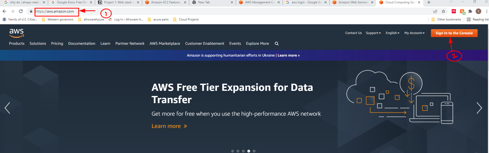

### **LAMP Stack configuration** 

The goal of project 1 is to install and document Install Linux, Apache, Mysql, and PHP (LAMP) on an Ubuntu 20.04 server located on an Amazon Web Service (AWS) Elastic Cloud Computing (EC2) infrastructure.

L

A

M

P

**Prerequisite:** Ubuntu system with an active `internet` connection

A user must complete some distinctive steps to achieve this goal.
 First, create an Amazon Web Service (AWS) account by going to the official AWS website, https://aws.amazon.com/, 

and creating a root account. Next, Sign up for a root email, username, and verify the email address. Amazon web Service will send the user a signup confirmation email.

After the initial sign-up process, the root user will create another user and designate the appropriate administrative privilege for the user. It is bad security practice to perform daily operations with the root privilege, thus we will be mostly interacting with AWS using the new user.

Step-by-Step Instruction to Create an Admin User

Login with Root Credentials 

If prompted, enter the captcha characters and then the password of the root account 

The next page is the amazon Web Service Management Console

Search and click  IAM (Identity and Asset Management)
Click on User Groups and the “create group” button on the right side
Next give the group a meaningful name. we will name our group administrators
Give the appropriate priviledge to the group. Our group will get the AdministratorAccess Priviledge in order to perform everyday job functions on AWS
Click on “create group” button 

The next step is to creat the user that will be a member of the Administrors Group we just created 

On the left hand side Select the Users
Next, click on the add User Button on the Right hand 

Give the User an appropriate name and Select the Password-AWS Management Console access radio

Add user to the administrators group by checking the radio and click on the next tags
Click on Next:Review and Create User Button 

log in with the new user account and change the region to the closest region.

The next task is to create and configure the Ubuntu virtual machine on the cloud with Elastic Cloud Compute (EC2) with the following steps.

Search and select “EC2” on the “search for services, features, blogs, docs and more” search box
Click on Launch Instances and search for “Ubuntu Server 20.04 Free Tier Eligible. Click the Select button on the right side of the server. On the next page, ensure that the free tier eligible radio is selected, then click on the “review and lunch” button. 

On the Next Page create a private key
From the Drop-Down menu select “create a new key pair,  Give the key pair a name and save the key pair in the Downloads folder, and click on the “launch instance “ button.

Confirm that the New Virtual Machine 
The next page should say instance is running. If not click on the refresh button to refresh the instance.

The next step is to connect to the Ubuntu instance and install our Apache, Mysql, and PHP applications on it. 

TO connect to the instance

Start up the ubuntu workstation and open the terminal on the system. 
To connect to the cloud ubuntu server get the Public IP address from AWS. Navigate to AWS’s EC2 dashboard and click on the instances

Copy the Public IPV4 address. In this case, the public IPv4 address is 54.90.118.109. PS. THis address changes whenever you stop the server.
Navigate to the Downloads directory by going to /home/(user)mickdon/Downloads. Then modify the rights on the file by typing “ sudo chmod 0400 Project11.pem”
Next, let us connect to the EC2 ubuntu server by typing the following command in the terminal “ec2-54-90-118-109.compute-1.amazonaws.com”
If everything goes well, we should be presented with a terminal that looks like this 

Next install and configure the remaining applications (Apache, Mysql, and PHP)  on the EC2 cloud based Ubuntu.
Simply type the”sudo apt install apache2” command in the terminal to install apache
Verify that apache is running by typing sudo systectl status apache2, and if the installation is fine you should have a terminal like the one below

Before we can pass traffic to the ubuntu server, we must first open the port 80 on the server. 
Go back to the AWS EC2 dashboard and add the port 80 HTTP to the rules 

Click on the Instance ID , Security Tab and the security group launch wizard.

In the next windows click “Edit inbound rules  by allowing HTTP, from any ip address (0.0.0.0/0), and then save the rules.
Now test out the rules by going on any web browser such as chrome, edge, or mozilla and type “http://54.90.118.109” in the address bar and enter on the keyboard. The next page should look like the one below if apache is properly configured.

Next, let us install and configure mysql server on the ubuntu server 
On the ubuntu terminal type “sudo apt install mysql-server” and enter
THe next task is to secure the mysql server from the known vulnerabilities. TO do that enter the “sudo mysql_secure_installation “and enter on the keyboard
And follow the prompts to enter the necessary security for your infrastructure.

To check the status of mysql status type in the terminal “sudo systemctl status mysql”

The next step is to install PHP on the ubuntu server

Install PHP by entering the following in the terminal “sudo apt install php libapache2-mod-php php-mysql”
Check for the version by using the “php -v” on the terminal 

Now that we have installed the applications on the server, it is time to configure the server. 

The next step is to create a virtual host for our apache server. On the terminal, navigate make a directory called projectlamp by using the following command “ sudo mkdir /var/www/projectlamp”. The next step is to assign ownership of the director to the current system user by using the following command “sudo chown -R $USER:$USER /var/www/projectlamp”
Configure an apache site by using the following command “$ sudo vi /etc/apache2/sites-available/projectlamp.conf”. Enter the following lines of code in the vi text editor 

<VirtualHost *:80> ServerName projectlamp ServerAlias www.projectlamp ServerAdmin webmaster@localhost DocumentRoot /var/www/projectlamp ErrorLog ${APACHE_LOG_DIR}/error.log CustomLog ${APACHE_LOG_DIR}/access.log combined </VirtualHost>   and save it with :wq

Next enter the “sudo a2ensite projectlamp” to enable the new virtual host

