### **LAMP Stack configuration** 

The goal of project 1 is to install and document Install Linux, Apache, Mysql, and PHP (LAMP) on an Ubuntu 20.04 server located on an Amazon Web Service (AWS) Elastic Cloud Computing (EC2) infrastructure.

**L** : Ubuntu 20.04 Linux is the distribution that  Apache, Mysql, and PHP will be installed on . I'll be installing a copy locally and another copy on Amazon's Elastic Cloud Computing platform. 

**A** : Apache server is an open source application that can host web applications. I'll be installing apache on the Ubuntu hosted on EC2.

**M** : MYSQL is a popular  open source relational database management system. It can handle most types of data,  and is widely used in organizations around the world.

**P** : PHP is a programming language used to build things for the web. It performs several functionalities for websites -- for example loading the contents, logging in to websites, and for plugins. 

### **Prerequisite:** 

**Ubuntu** system with an active internet connection

**Amazon Web Service Account** A user must create an amazon web Account to get applications on the cloud.

## **Use the following steps to create an AWS Account **

 First, create an Amazon Web Service (AWS) account by going to the official AWS website, https://aws.amazon.com/. 

>

The Next step is to create a root account. The root account is the most powerful account on AWS. It can perform functionalities such as billing, user creation and deletion, close AWS account, view tax information, change AWS support plans among others

>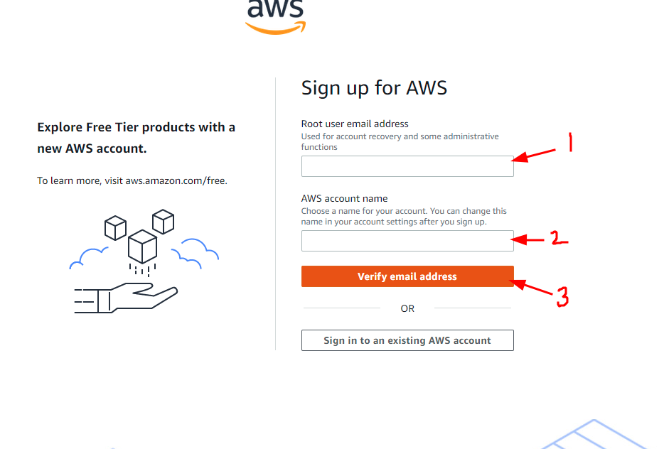

 Next, Sign up for a root email, username, and verify the email address. Amazon web Service will send the user a signup confirmation email.

 >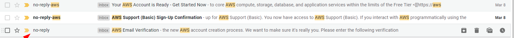

After the initial sign-up process, the root user will create another user and designate the appropriate administrative privilege for the user. It is bad security practice to perform daily operations with the root privilege, thus we will be mostly interacting with AWS using the new user.

## **Step-by-Step Instruction to Create an Admin User**

Login with Root Credentials 

>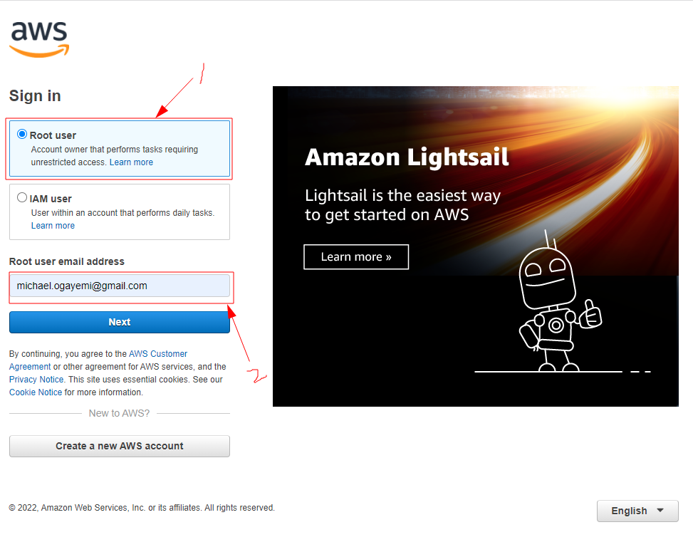

If prompted, enter the `captcha` characters and then the password of the root account.

The next page is the Amazon Web Service Management Console.

>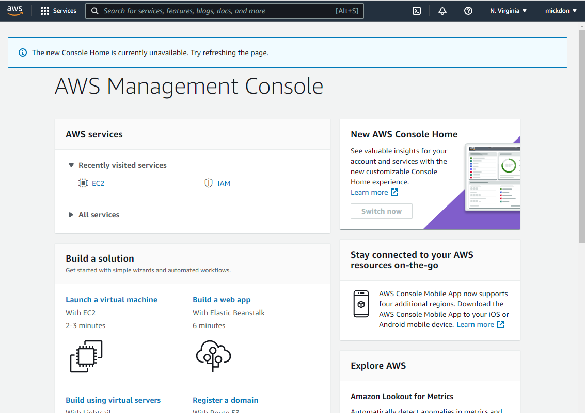

Search and click  **IAM (Identity and Asset Management)**.

Click on **User Groups** and then **”create group”** button on the top right corner of the page..

>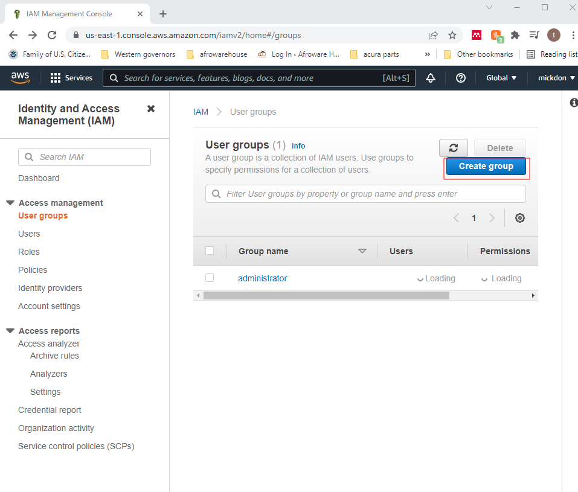

Next give the group a meaningful name. we will name our group **administrators**.

>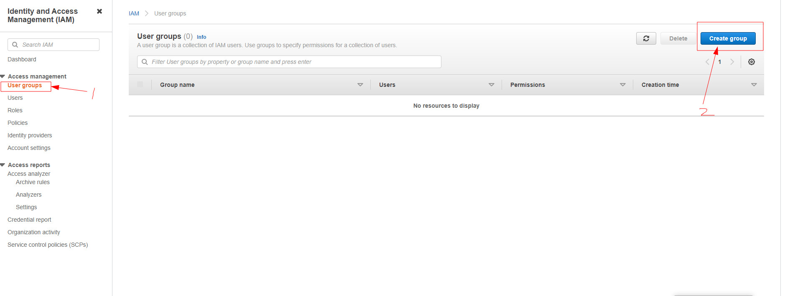

Give the appropriate privilege to the group. Our group will get the **AdministratorAccess** privilege in order to perform everyday job functions on AWS.

Click on **“create group”**  button. 
The next step is to create the user that will be a member of the *Administrators* Group we just created in the previous step.  

>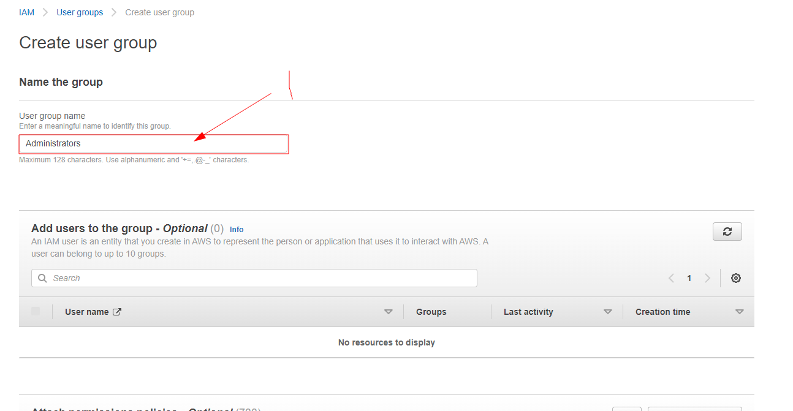

On the left hand side Select the **Users**.

Next, click on the **Add User** Button on the Right hand. 

Give the User an appropriate name and Select the **Password-AWS** Management Console access radio. 

>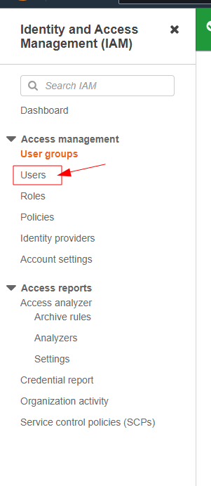

Add user to the administrators group by checking the radio and click on  **Next:Tags**

Click on **Next:Review** and then the **Create User** Button 

>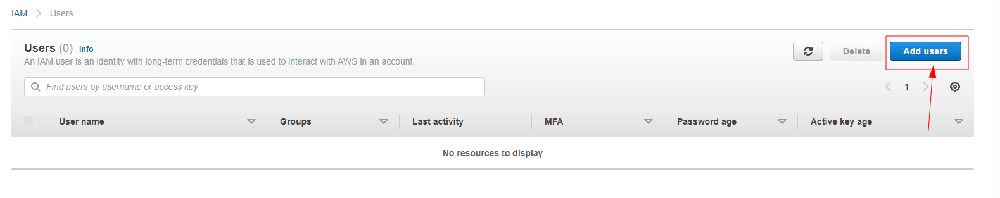

Finally, put the user in a  group. 

>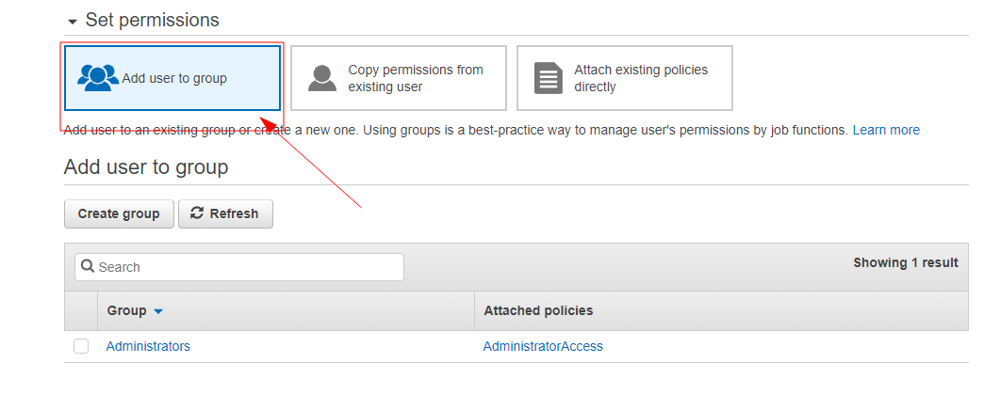

Log in with the new user account and change the region to the closest region.

### **Provisioning an EC2 Instance**

**The next task is to create and configure the Ubuntu virtual machine on the cloud with Elastic Cloud Compute (EC2) with the following steps.**

Once logged in to AWS as the new user we created. Search and select **“EC2”** on the “search for services, features, blogs, docs and more” search box.

>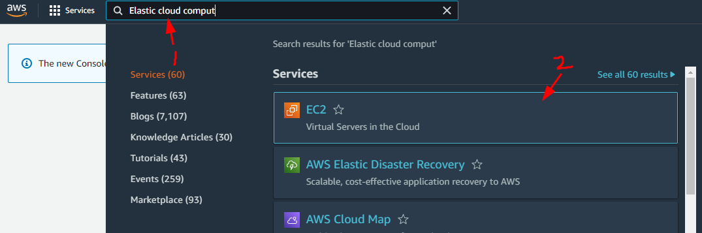

Click on **Launch Instances** and search for **Ubuntu Server 20.04** Free Tier Eligible. 

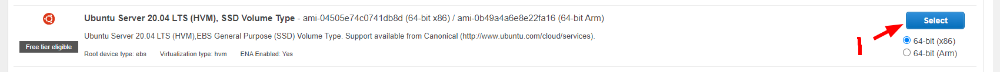

Click the **Select** button on the right side of the server. On the next page, ensure that **t2.micro**free tier eligible radio is selected, then click on the **“Review and launch”** button. 

On the Next Page create a private key.

From the Drop-Down menu select **create a new key pair**, give the key pair a name and save the key pair in an accessible folder, you will need it later in the project. 

>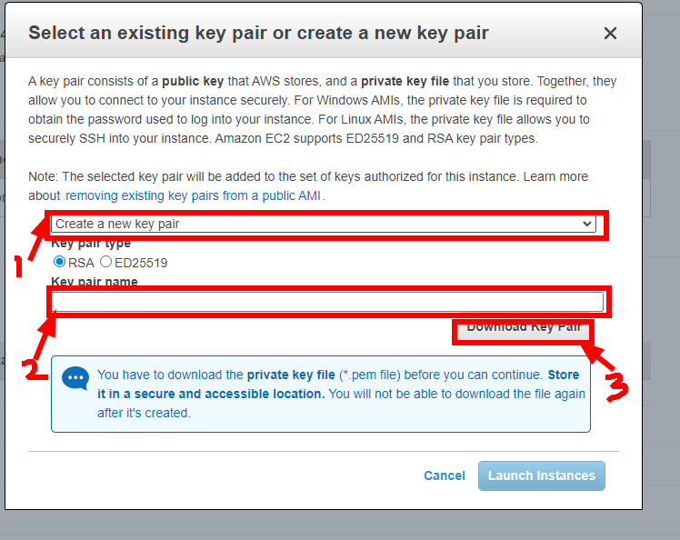

click on the **Launch instance** button.

>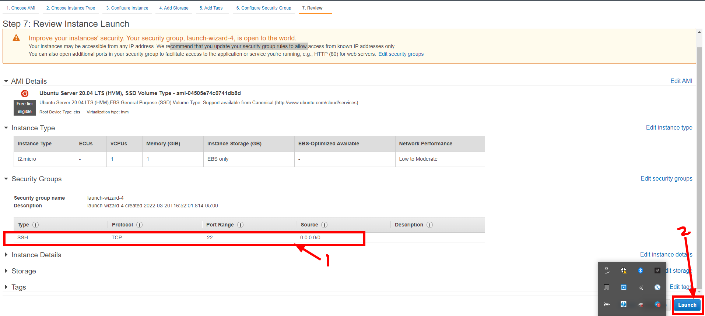

Confirm that the New Ubuntu Virtual Machine is running.

The next page should say instance is **running**. If not, click on the refresh button to refresh the instance.

>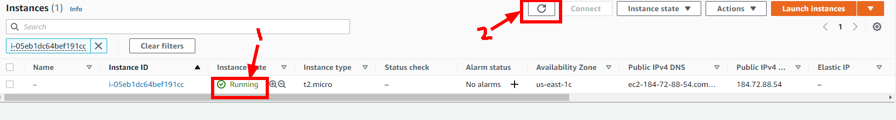

### **Connecting EC2 to Terminal**

The next step is to connect to the Ubuntu instance and install our Apache, Mysql, and PHP applications on it.

To connect to the instance:

Start up the ubuntu workstation and open the terminal on the system. 

To connect to the cloud Ubuntu server, get the `Public IP` address from AWS. Navigate to AWS’s EC2 dashboard and click on the instances.

>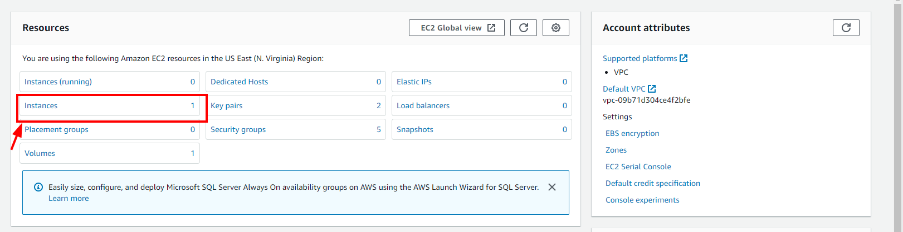

Copy the Public IPV4 address. In this case, the public IPv4 address is `54.90.118.109`. 

**Note**:This address changes whenever you stop the server.

Navigate to the Downloads directory by going to:

    $ cd /home/(user)mickdon/Downloads

Then modify the rights on the file by typing: 

    $ sudo chmod 0400 Project11.pem”

>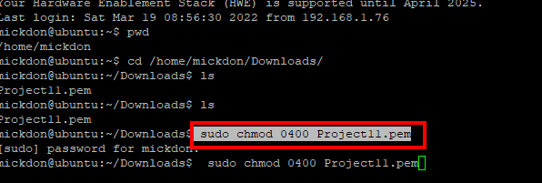

Next, let us connect to the `EC2` ubuntu server by typing the following command in the terminal 

    $ ec2-54-90-118-109.compute-1.amazonaws.com

If everything goes well, we should be presented with a terminal that looks like this 

### **Install Apache** 

Run the below to install apache:

    $ sudo apt install apache2

>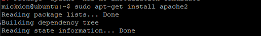

Verify that apache is running by typing:

    $ sudo systectl status apache2

If the installation is fine you should have a terminal like the one below.

>

Before we can pass traffic to the ubuntu server, we must first open the `Port 80` on the server. 

Go back to the AWS EC2 dashboard and add the `port 80 HTTP` to the rules.

>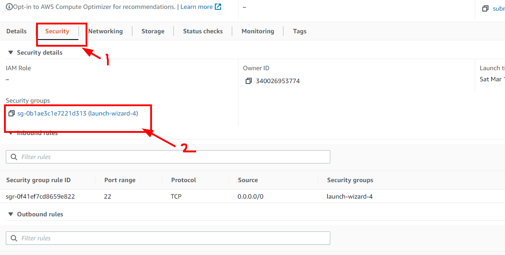

Click on the **Instance ID** , then **Security** Tab and the **security group launch wizard**.

In the next window click **Edit inbound rules**  by allowing `HTTP`, from any ip address `(0.0.0.0/0)`, and then save the rules.

>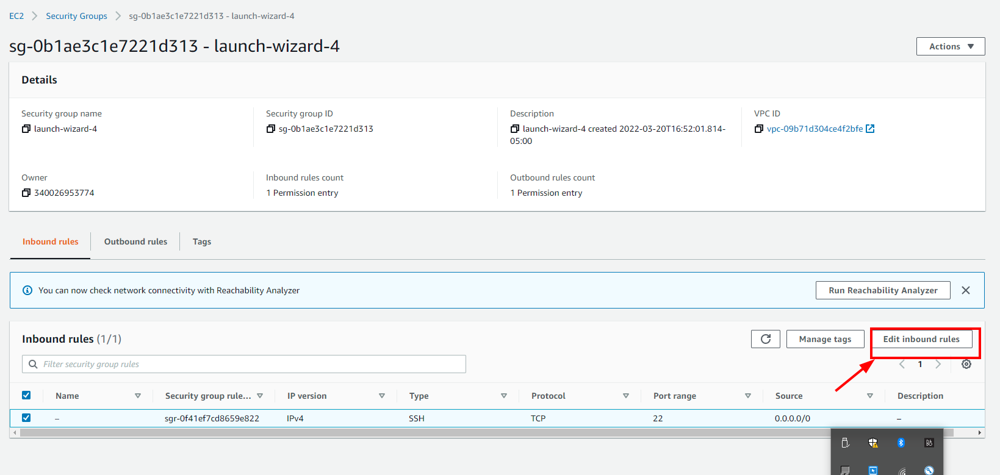

>

Now test out the rules by going on any web browser such as chrome, edge, or mozilla and type `http://54.90.118.109` in the address bar and click the enter on the keyboard. The next page should look like the one below if apache is properly configured.

>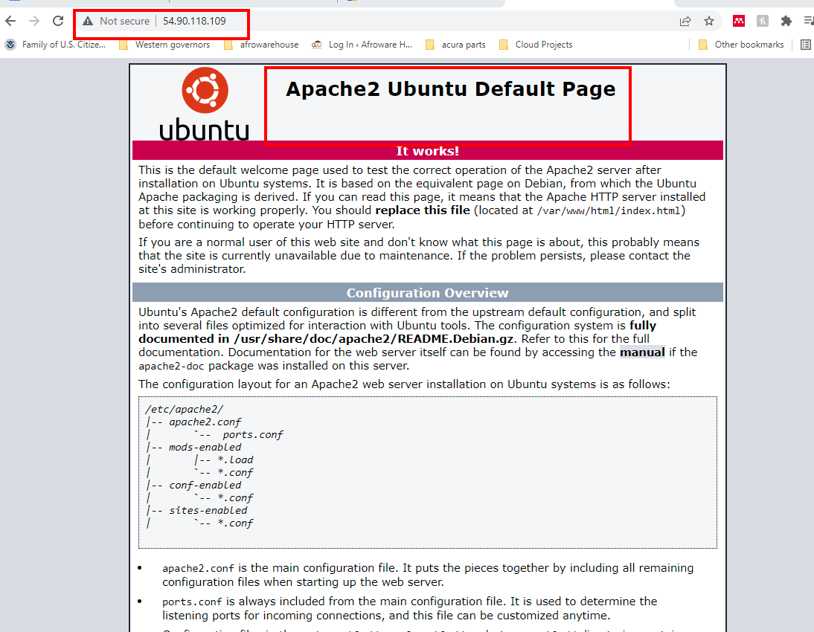

### **Install MySQL** 

On the ubuntu terminal type:

    $ sudo apt install mysql-server

>

The next task is to secure the mysql server from the known vulnerabilities. To do that enter:
 
    $ sudo mysql_secure_installation

>

Follow the prompts to enter the necessary security for your infrastructure.

To check the status of mysql status type in the terminal:

    $ sudo systemctl status mysql

>

### **Install PHP** 

The next step is to install PHP on the ubuntu server

Install PHP by entering the following in the terminal 

    $ sudo apt install php libapache2-mod-php php-mysql

>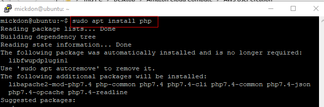

Check for the version by using the `php -v` on the terminal 

Now that we have installed the applications on the server, it is time to configure the server. 

>

### **Install Virtual Host**

The next step is to create a virtual host for our apache server. On the terminal, navigate to the directory called project lamp by using the following command:
    $ sudo mkdir /var/www/projectlamp

>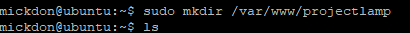

The next step is to assign ownership of the director to the current system user by using the following command 

    $ sudo chown -R $USER:$USER /var/www/projectlamp

>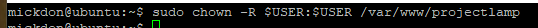

Configure an apache site by using the following command 

    $ sudo vi /etc/apache2/sites-available/projectlamp.conf

 Enter the following lines of code in the vi text editor 

><VirtualHost *:80>
>
>	 ServerName projectlamp 
>
>	ServerAlias www.projectlamp 
>
>	ServerAdmin webmaster@localhost 
>
>	DocumentRoot /var/www/projectlamp 
>
>	ErrorLog ${APACHE_LOG_DIR}/error.log 
>
>	CustomLog ${APACHE_LOG_DIR}/access.log combined 
>
></VirtualHost>   

Save the file with `:wq`.

Next enable the virtual host by entering:

    $ sudo a2ensite projectlamp

Disable Apache’s default website:

    $ sudo a2dissite 000-default 

Check the configuration file for syntax error:

    $ sudo apache2ctl configtest

Reload Apache:

    $ sudo systemctl reload apache2

To test the content, open your IP address in your browser

>Output:
>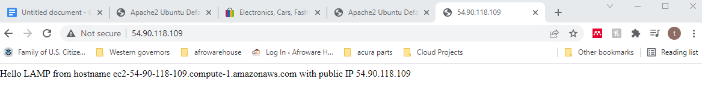
> 

The next step is to enable PHP on the website and allow it supersede the html file:

    $ sudo vim /etc/apache2/mods-enabled/dir.conf

Edit the file  

>
> \<IfModule mod_dir.c>
>
>	#change this: #DirectoryIndex index.html index.cgi index.pl index.php index.xhtml index.htm #To this: index.php index.html index.cgi index.pl index.xhtml index.htm
>
> </IfModule>
	

Reload apache:

    $ sudo systemctl reload apache2

Test PHP by creating a PHP script:

    $ vim /var/www/projectlamp/index.php

Input:

> /<?php
>
>phpinfo();
>

To verify the changes, reload your public ip address

>

